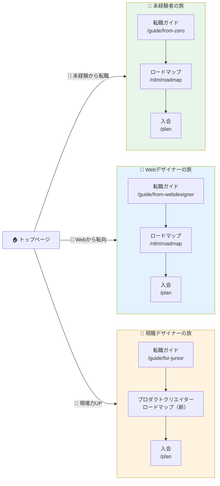

# トップページ構成

スタイル: [PATTERN-E-STYLE.md](./PATTERN-E-STYLE.md)

---

## セクション構成

<!-- ここに構成を記載 -->

# BONOトップページ構成提案：3つのニーズに訴求する

> 作成日: 2026-03-09
> 最終更新: 2026-03-09
> 目的: トップページで「あなたにBONOはこれを提供できます」を明確に伝える

---

## 🎯 前提：BONOの3つのターゲットニーズ

| #   | ニーズ                                   | ペルソナの状態                         | 本音                                       |
| --- | ---------------------------------------- | -------------------------------------- | ------------------------------------------ |
| A   | **未経験からUIUXデザイナーに転職したい** | デザイン未経験。他業種で働いている     | 「何から始めればいいかわからない」         |
| B   | **WebデザインからUIUXに転向したい**      | Webデザインの経験はある。UIUXは未知    | 「違いが分からない。何が足りない？」       |
| C   | **UIUXの現場で使えるナレッジが欲しい**   | 現職UIUXデザイナー（ジュニア〜ミドル） | 「自己流でやっていて不安。正解を知りたい」 |

### 2026年の方向性との整合

```
2026 ONE THING: 「作業者がクリエイターに化ける瞬間を作る」

A（未経験→転職） = 作業者ですらない → UIの基礎を持った「作業者」にする
B（Web→UIUX）   = Webの作業者 → UIUXの「作業者」にキャリアアップ
C（現場ナレッジ） = UIUXの作業者 → 根拠を持った「クリエイター」に化ける ★核心
```

**A→B→Cの順に、BONOの本質（クリエイターへの変容）に近づいていく。**

---

## 📐 トップページ全体構成

```
┌──────────────────────────────────────────────────────┐
│                                                       │
│  ① ヒーロー                                            │
│     「UIUXデザインの力で、作る人から創る人へ」             │
│                                                       │
├──────────────────────────────────────────────────────┤
│                                                       │
│  ② ニーズ別入口（悩みの言葉で入る）                       │
│     [ 何からはじめれば？ ] [ WebとUIUXの違いは？ ] [ 自己流が不安 ] │
│                                                       │
├──────────────────────────────────────────────────────┤
│                                                       │
│  ③ BONOで学べること（3つの基礎 + α）                     │
│                                                       │
├──────────────────────────────────────────────────────┤
│                                                       │
│  ④ BONOメンバーのアウトプット（作品で語る）                 │
│                                                       │
├──────────────────────────────────────────────────────┤
│                                                       │
│  ⑤ BONOの特徴（他との違い）                              │
│                                                       │
├──────────────────────────────────────────────────────┤
│                                                       │
│  ⑥ 料金・CTA                                          │
│                                                       │
└──────────────────────────────────────────────────────┘
```

---

## 各セクションの詳細

### ① ヒーロー

**現状の問題:** 「すべての人に創造性の夜明けを」は美しいが、**何のサービスかわからない。**

**提案:**

```
┌──────────────────────────────────────────────────┐
│                                                   │
│   UIUXデザインの力で、                               │
│   作る人から、創る人へ。                              │
│                                                   │
│   未経験からの転職、Webからのキャリアアップ、             │
│   現場で使える実践力。                                │
│   プロと学べるUIUXデザインのオンラインコース。            │
│                                                   │
│   [BONOをはじめる]  [まずはガイドを読む]               │
│                                                   │
└──────────────────────────────────────────────────┘
```

**ポイント:**

- 1行目：感情に訴える（変容のビジョン）
- 2〜3行目：具体的に「誰向けか」を明示（3ニーズを一文で）
- CTA：2つ用意（行動派向け / 慎重派向け）

---

### ② ニーズ別入口（悩みの言葉で入る）

**これがこのページの核心。** ユーザーが「自分の悩みだ」と3秒で共感できるカード。

ペルソナ名（「未経験から」「Webから」）ではなく **悩みの言葉** で入口を作る。
ユーザーは自分の「属性」は判断しにくいが、「感情」にはすぐ共感できるため。

```
┌──────────────────────────────────────────────────┐
│                                                   │
│  あなたの「今の悩み」に合った道を見つけよう              │
│                                                   │
│  ┌─────────────┐ ┌─────────────┐ ┌─────────────┐  │
│  │               │ │               │ │               │ │
│  │ 何からはじめ  │ │ WebとUIUXって │ │ 自己流で      │ │
│  │ ればいいか    │ │ 何が違うの？  │ │ やってるのが  │ │
│  │ わからない    │ │ 何を学べば    │ │ 不安          │ │
│  │               │ │ いい？        │ │               │ │
│  │ ────────────  │ │ ────────────  │ │ ────────────  │ │
│  │               │ │               │ │               │ │
│  │ デザイン未経験 │ │ Webの経験は   │ │ UIUXの仕事を  │ │
│  │ でもBONOなら  │ │ あるけどUIUX │ │ しているけど  │ │
│  │ 転職実績のある │ │ は未知。違いを│ │ プロの根拠ある│ │
│  │ 道を一歩ずつ  │ │ 理解して最短で│ │ やり方を身に  │ │
│  │ 進める        │ │ 転向できる    │ │ つけたい      │ │
│  │               │ │               │ │               │ │
│  │ → 提供するもの │ │ → 提供するもの │ │ → 提供するもの │ │
│  │ ✅ 転職ロード  │ │ ✅ Web vs UIUX │ │ ✅ 実務で使う  │ │
│  │   マップ      │ │   の違い解説   │ │   設計思考    │ │
│  │ ✅ 3つの基礎   │ │ ✅ 足りない    │ │ ✅ フィード   │ │
│  │   コース      │ │   スキルを特定 │ │   バック      │ │
│  │ ✅ ポートフォ  │ │ ✅ 転向した人  │ │ ✅ プロダクト  │ │
│  │   リオ支援    │ │   の実例      │ │   クリエイター │ │
│  │               │ │               │ │   への道      │ │
│  │ [自分に合った │ │ [自分に合った │ │ [自分に合った │ │
│  │  道を見る]    │ │  道を見る]    │ │  道を見る]    │ │
│  └─────────────┘ └─────────────┘ └─────────────┘  │
│                                                   │
└──────────────────────────────────────────────────┘
```

**なぜ「悩みの言葉」なのか:**

|                    | ペルソナ名（旧）                       | 悩みの言葉（新）                     |
| ------------------ | -------------------------------------- | ------------------------------------ |
| **カードの見出し** | 「未経験からUIUXデザイナーになりたい」 | 「何からはじめればいいかわからない」 |
| **ユーザーの反応** | 「私はこのカテゴリに合うかな…？」      | 「そう！まさにそれ！」               |
| **判断の基準**     | 自分の **属性** を判断する（考える）   | 自分の **感情** に共感する（感じる） |

**各カードのリンク先:**

| カード                  | リンク先                                                 | 備考                      |
| ----------------------- | -------------------------------------------------------- | ------------------------- |
| 「何からはじめれば？」  | `/guide/from-zero` → `/rdm/roadmap-uiuxdesigner`         | ガイド→ロードマップの流れ |
| 「WebとUIUXの違いは？」 | `/guide/from-webdesigner`                                | 旧usecaseの統合先         |
| 「自己流が不安」        | `/guide/for-junior` → プロダクトクリエイターロードマップ | 2026新規の入口            |

---

### ③ BONOで学べること

3つの基礎＋αを簡潔に見せる。**現状のトップページにもあるが、ニーズとの接続が弱い。**

```
┌──────────────────────────────────────────────────┐
│                                                   │
│  BONOで身につく力                                   │
│                                                   │
│  ┌──────────┐ ┌──────────┐ ┌──────────┐          │
│  │ 🎨        │ │ 📐        │ │ 🧠        │         │
│  │ UIビジュアル│ │ 情報設計   │ │ UXデザイン │         │
│  │            │ │            │ │            │        │
│  │ 見た目の   │ │ 使いやすさ │ │ 顧客理解と │         │
│  │ 基本を作る │ │ を設計する │ │ 課題解決   │         │
│  └──────────┘ └──────────┘ └──────────┘          │
│                                                   │
│         ＋                                         │
│                                                   │
│  ┌───────────────────────────────────────┐         │
│  │ 🤖 AI時代のデザインスキル（Coming Soon）  │        │
│  │ Claude/Cursorで動くプロトタイプを作る     │        │
│  │ AIの出力を評価・改善する力を身につける     │        │
│  └───────────────────────────────────────┘         │
│                                                   │
│  [コース一覧を見る]                                  │
│                                                   │
└──────────────────────────────────────────────────┘
```

**ニーズとの対応表:**

| 学べること   | 🌱 未経験  | 🔀 Web→UIUX  | 🚀 現場力UP |
| ------------ | ---------- | ------------ | ----------- |
| UIビジュアル | ◎ ゼロから | ○ 基礎確認   | △ 復習      |
| 情報設計     | ◎ ゼロから | ◎ 最大の差分 | ◎ 実務直結  |
| UXデザイン   | ◎ ゼロから | ◎ 最大の差分 | ◎ 実務直結  |
| AI×デザイン  | △ まず基礎 | ○ 武器になる | ◎ 差別化    |

---

### ④ BONOメンバーのアウトプット

**信頼の証拠（Social Proof）。** 経歴ではなく **作品の質** で語る。

「保育士→デザイナー」のような経歴変化を前面に出すと「未経験専用サービス」に見えてしまう。
代わりにアウトプット（作品）を主役にすることで、全レベルのユーザーに「ここは本物だ」と伝える。
経歴のラベルは小さく添えるだけ。

```
┌──────────────────────────────────────────────────┐
│                                                   │
│  BONOメンバーのデザイン                               │
│                                                   │
│  ┌──────────┐ ┌──────────┐ ┌──────────┐           │
│  │ [作品画像] │ │ [作品画像] │ │ [作品画像] │          │
│  │           │ │           │ │           │          │
│  │ 音声SNSの  │ │ SaaS管理   │ │ 出張申請   │          │
│  │ UIデザイン │ │ 画面の     │ │ サービスの │          │
│  │           │ │ 情報設計   │ │ UXリデザイン│          │
│  │           │ │           │ │           │          │
│  │ 🌱 未経験  │ │ 🔀 Webから │ │ 🚀 現職   │          │
│  └──────────┘ └──────────┘ └──────────┘           │
│                                                   │
│  「未経験の人も、現場のデザイナーも、                   │
│    根拠のあるUIUXデザインを身につけています」           │
│                                                   │
│  [メンバーのアウトプットをもっと見る]                    │
│                                                   │
└──────────────────────────────────────────────────┘
```

**なぜ「アウトプット」なのか:**

| 見る人            | 受け取るメッセージ                                       |
| ----------------- | -------------------------------------------------------- |
| 🌱 未経験者       | 「ゼロからでもこのレベルの作品が作れるんだ」             |
| 🔀 Webデザイナー  | 「UIUXってこういうアウトプットなのか。自分もできそう」   |
| 🚀 現職デザイナー | 「ちゃんとした情報設計をやってる。レベルが低くなさそう」 |

---

### ⑤ BONOの特徴（Why BONO?)

**「スクールとの違い」を明確に。** BONOの独自ポジションを3点で伝える。

```
┌──────────────────────────────────────────────────┐
│                                                   │
│  なぜBONOなのか                                    │
│                                                   │
│  ┌──────────────────────────────────┐              │
│  │ 1. 実務で使える「3つの基礎」を体系的に │           │
│  │    スクールにはない、転職実績のある     │           │
│  │    UIUXデザイン特化のカリキュラム       │           │
│  └──────────────────────────────────┘              │
│                                                   │
│  ┌──────────────────────────────────┐              │
│  │ 2. プロからのフィードバック           │           │
│  │    作って終わりにしない。             │           │
│  │    現役デザイナーが添削・相談に対応     │           │
│  └──────────────────────────────────┘              │
│                                                   │
│  ┌──────────────────────────────────┐              │
│  │ 3. 仲間がいるコミュニティ             │           │
│  │    学習の孤独を解消。                 │           │
│  │    同じ目標を持つ人と一緒に学べる       │           │
│  └──────────────────────────────────┘              │
│                                                   │
└──────────────────────────────────────────────────┘
```

---

### ⑥ 料金・CTA

**シンプルに。迷わせない。**

```
┌──────────────────────────────────────────────────┐
│                                                   │
│  まずは始めてみよう                                  │
│                                                   │
│  ┌─────────────┐      ┌─────────────┐            │
│  │ スタンダード   │      │ フィードバック │            │
│  │ ¥X,XXX/月     │      │ ¥X,XXX/月    │            │
│  │               │      │               │           │
│  │ 解説動画      │      │ 解説動画      │            │
│  │ コミュニティ   │      │ コミュニティ   │            │
│  │ 質問/相談     │      │ 質問/相談     │            │
│  │               │      │ ＋ FB         │            │
│  │               │      │ ＋ 添削       │            │
│  │               │      │ ＋ キャリア相談│            │
│  │ [はじめる]     │      │ [はじめる]     │            │
│  └─────────────┘      └─────────────┘            │
│                                                   │
│  [料金プランの詳細を見る → /plan]                     │
│                                                   │
└──────────────────────────────────────────────────┘
```

---

## 🔄 現状のトップページとの差分

| 要素         | 現状                                       | 提案                                | 変更理由                                   |
| ------------ | ------------------------------------------ | ----------------------------------- | ------------------------------------------ |
| ヒーロー     | 「すべての人に創造性の夜明けを」（抽象的） | 「作る人から創る人へ」＋3ニーズ明示 | 何のサービスか伝わらない                   |
| ニーズ別入口 | なし（ロードマップしかない）               | **「悩みの言葉」で共感→3カード**    | ペルソナ名ではなく悩みで入ることで共感率UP |
| コース紹介   | 個別コースが並列に並ぶ                     | 3つの基礎＋AI として構造化          | 「何が学べるか」が一目で分かる             |
| アウトプット | 転職ストーリー中心（未経験専用に見える）   | **作品を主役に、経歴は添えるだけ**  | 全レベルに「本物だ」と伝わる               |
| 特徴/Why     | `/membership` に分離                       | トップに統合                        | 初回訪問で完結すべき情報                   |
| 料金         | あるが詳細すぎる                           | シンプルに2プラン表示               | 迷わせない                                 |

---

## 📐 ニーズ×ページの導線マップ



---

## 💡 設計思想のまとめ

### Airbnb的に言えば

Airbnbのトップページは **「どこに行きたい？」** という1つの質問から始まる。
BONOのトップページも **「あなたは今どこにいる？」** という1つの質問から始めるべき。

```
Airbnb:  「どこに泊まりたい？」 → 検索 → 結果 → 予約
BONO:    「あなたは今どこにいる？」 → ニーズ選択 → ガイド/ロードマップ → 入会
```

### やらないこと

- すべてのコースを並べて見せること（情報過多）
- 抽象的なビジョンだけで終わること（行動につながらない）
- 全ペルソナに同じメッセージを送ること（誰にも刺さらない）

### やること

- **3秒で「自分はここだ」と分かる入口を作る**
- 各ニーズに対して「BONOが提供できるもの」を明示する
- 理解→実行→入会の流れを1ページ内で完結させる
