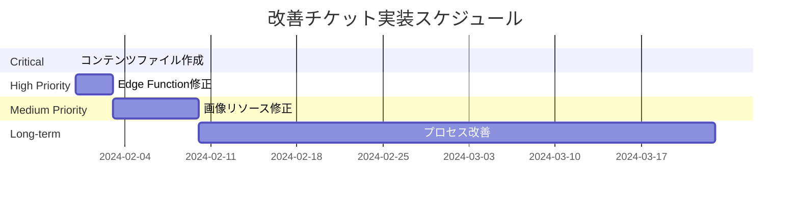

# 📋 改善チケット実装計画

## 概要

コンソールログ分析とコンテンツ検証により特定された重大問題の解決計画です。

---

## 🚀 Phase 1: 緊急対応（Critical Priority）
**期限**: 即座（30分以内）  
**ステータス**: 未着手

### 対象チケット
- [#06: 重要コンテンツファイル欠損の緊急修正](./ticket-06-critical-content-missing.md)

### 実装タスク

#### 1.1 `ec-product-catalog/index.md` 作成
```markdown
---
title: "ECサイト商品カタログをデザインしよう"
description: "実践的なECサイトの商品カタログUIを設計し、情報アーキテクチャから実装まで学習します"
type: "challenge"
difficulty: "normal"
category: "UIデザイン"
tags: ["UI", "EC", "カタログ", "情報設計"]
isPremium: false
order_index: 2
thumbnail: "/assets/backgrounds/ec-catalog-bg.svg"
icon: "🛒"
skills:
  - "情報アーキテクチャ"
  - "UIワイヤーフレーム"
  - "要件分析"
estimated_total_time: "4-5時間"
task_count: 3
---
```

#### 1.2 タスクファイル修正
- `tasks/requirements-analysis/content.md` フロントマター統一
- `tasks/information-architecture/content.md` フロントマター統一  
- `tasks/ui-wireframe/content.md` フロントマター統一

### 完了基準
- [ ] `/training` ページで正しいタイトル表示
- [ ] Console ログでエラー解消
- [ ] Edge Function が適切なデータを返す

---

## 🔧 Phase 2: Edge Function修正（High Priority）
**期限**: 3日以内  
**ステータス**: 未着手

### 対象チケット
- [#07: Edge Function フロントマター解析バグ修正](./ticket-07-edge-function-parsing-bug.md)

### 実装タスク

#### 2.1 `parseFrontmatter` 関数改善
```typescript
// より堅牢なYAML解析
function parseFrontmatter(content: string): TrainingMetadata {
  const yaml = require('js-yaml');
  const frontmatterRegex = /^---\n([\s\S]*?)\n---/;
  const match = content.match(frontmatterRegex);
  
  if (!match) throw new Error('フロントマターが見つかりません');
  
  try {
    return yaml.load(match[1]) as TrainingMetadata;
  } catch (error) {
    console.error('YAML解析エラー:', error);
    throw new Error('フロントマター解析に失敗');
  }
}
```

#### 2.2 データ優先順位の明確化
- `index.md` データを最優先
- タスクファイルは補完情報としてのみ使用
- ファイル存在チェック強化

#### 2.3 エラーハンドリング強化
- 詳細なログ出力
- 段階的フォールバック機能
- データ検証機能

### 完了基準
- [ ] 複数行YAML正常解析
- [ ] データ優先順位の正常動作
- [ ] 堅牢なエラーハンドリング

---

## 🎨 Phase 3: リソース修正（Medium Priority）
**期限**: 1週間以内  
**ステータス**: 未着手

### 対象チケット
- [#08: 画像リソース欠損修正](./ticket-08-missing-image-resources.md)

### 実装タスク

#### 3.1 `ec-catalog-bg.svg` 作成
- ECサイトテーマの背景画像生成
- 既存背景画像との一貫性確保
- 最適化されたSVGフォーマット

#### 3.2 アイコン統一
- 全トレーニングのアイコン統一
- 絵文字からSVGアイコンへの移行検討
- アセット管理プロセス整備

### 完了基準
- [ ] 404エラー解消
- [ ] 視覚的一貫性確保
- [ ] アセット管理改善

---

## 📈 Phase 4: プロセス改善（Long-term）
**期限**: 2-6週間  
**ステータス**: 未着手

### 対象チケット
- [#09: プロセス改善・再発防止策](./ticket-09-process-improvement.md)

### 実装タスク

#### 4.1 コンテンツ作成チェックリスト（1-2週間）
- 必須ファイル作成チェック
- フロントマター検証スクリプト
- 自動化検証ツール

#### 4.2 テスト体制強化（2-4週間）
- Edge Function ユニットテスト拡充
- インテグレーション/回帰テスト自動化
- CI/CDパイプライン改善

#### 4.3 監視・アラートシステム（4-6週間）
- 品質メトリクス定義
- 各種アラート設定
- ダッシュボード構築

### 完了基準
- [ ] 検証体制確立
- [ ] 自動化テスト実装
- [ ] 監視システム稼働

---

## 📊 スケジュール



## 🎯 成功指標

### 短期効果（Phase 1-2完了時）
- Console エラー 0件
- `/training` ページ正常表示率 100%
- Edge Function レスポンス時間 < 500ms

### 中期効果（Phase 3完了時）
- 404エラー 0件
- 視覚的一貫性スコア > 90%
- ユーザビリティ向上

### 長期効果（Phase 4完了時）
- コンテンツエラー率 < 1%
- 問題解決時間 < 30分
- 回帰バグ発生率 < 5%

---

**最終更新**: 2024年1月31日  
**担当者**: 開発チーム  
**レビュー**: 各フェーズ完了時