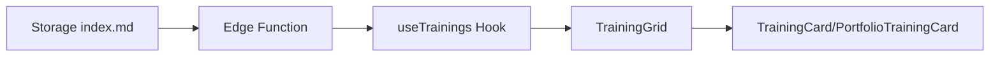

# 🔧 [緊急度：中] UI表示ロジック調査・修正

## 問題の詳細

### 現象
- 「UIワイヤーフレーム作成」のコンテンツが古いコンポーネントで呼び出されている
- `type: "challenge"` のトレーニングが `PortfolioTrainingCard` で表示されている可能性
- 新しいコンポーネントの情報が `index.md` の情報を正しく反映していない

### 予想される問題箇所
```typescript
// src/components/training/TrainingGrid.tsx
{trainings.map((training) => (
  training.type === 'portfolio' ? (
    <PortfolioTrainingCard key={training.id} training={training} />
  ) : (
    <TrainingCard key={training.id} training={training} />
  )
))}
```

### 影響範囲
- `/training` ページでのカード表示
- ユーザーエクスペリエンスの一貫性
- トレーニング情報の正確性

## 調査手順

### 1. データフロー確認


### 2. 各段階でのデータ構造確認
```typescript
// 1. Edge Function レスポンス
console.log('Edge Function Response:', response.data);

// 2. useTrainings フック
const { data: trainings } = useTrainings();
console.log('useTrainings data:', trainings);

// 3. TrainingGrid に渡されるデータ
console.log('TrainingGrid props:', { trainings });

// 4. 各カードコンポーネントに渡されるデータ
console.log('Card props:', { training });
```

### 3. type フィールドの整合性確認
```bash
# 各 index.md の type フィールド調査
grep -r "type:" content/training/*/index.md
```

### 4. コンポーネント動作確認
- `TrainingCard` の表示内容・スタイル確認
- `PortfolioTrainingCard` の表示内容・スタイル確認
- 条件分岐ロジックの適切性確認

## 解決策の実装内容

### A. type 値の正規化

#### 各 index.md の type 確認・修正
```yaml
# ec-product-catalog/index.md
type: "challenge"  # 正しい値

# info-odai-book-rental/index.md  
type: "portfolio"  # 正しい値

# todo-app/index.md
type: "portfolio"  # 正しい値

# ux-basics/index.md
type: "portfolio"  # 正しい値
```

### B. TrainingGrid コンポーネント強化
```typescript
// src/components/training/TrainingGrid.tsx
const TrainingGrid: React.FC<TrainingGridProps> = ({ trainings }) => {
  // デバッグログ追加
  useEffect(() => {
    console.log('TrainingGrid received trainings:', trainings);
    trainings.forEach(training => {
      console.log(`Training ${training.slug}: type=${training.type}`);
    });
  }, [trainings]);

  return (
    <div className="grid grid-cols-1 md:grid-cols-2 lg:grid-cols-3 gap-8 px-4">
      {trainings.map((training) => {
        // より明確な条件分岐
        const isPortfolio = training.type === 'portfolio';
        
        return isPortfolio ? (
          <PortfolioTrainingCard key={training.id} training={training} />
        ) : (
          <TrainingCard key={training.id} training={training} />
        );
      })}
    </div>
  );
};
```

### C. 各カードコンポーネントの適切性確認

#### TrainingCard (challenge, skill 用)
```typescript
// 期待される使用ケース
// - type: "challenge" (例: ec-product-catalog)
// - type: "skill" 
// - シンプルな情報表示
// - アクション重視のデザイン
```

#### PortfolioTrainingCard (portfolio 用)  
```typescript
// 期待される使用ケース
// - type: "portfolio" (例: info-odai-book-rental, todo-app, ux-basics)
// - ポートフォリオ作成重視
// - プロジェクト感のあるデザイン
```

### D. エラーハンドリング強化
```typescript
// TrainingGrid.tsx
{trainings.map((training) => {
  // type の検証
  if (!training.type || !['challenge', 'skill', 'portfolio'].includes(training.type)) {
    console.warn(`Invalid training type: ${training.type} for ${training.slug}`);
    // デフォルトを challenge とする
    training.type = 'challenge';
  }
  
  return training.type === 'portfolio' ? (
    <PortfolioTrainingCard key={training.id} training={training} />
  ) : (
    <TrainingCard key={training.id} training={training} />
  );
})}
```

## テスト方法

### 1. データ流通確認
```typescript
// src/pages/Training/index.tsx にデバッグコード追加
const TrainingPage = () => {
  const { data: trainings, isLoading, error } = useTrainings();
  
  useEffect(() => {
    if (trainings) {
      console.table(trainings.map(t => ({
        slug: t.slug,
        title: t.title,
        type: t.type,
        component: t.type === 'portfolio' ? 'PortfolioTrainingCard' : 'TrainingCard'
      })));
    }
  }, [trainings]);
  
  // ...
};
```

### 2. 視覚的確認
- `/training` ページで 4つのカードが表示されることを確認
- `ec-product-catalog` が `TrainingCard` で表示されることを確認
- `info-odai-book-rental`, `todo-app`, `ux-basics` が `PortfolioTrainingCard` で表示されることを確認

### 3. レスポンシブ確認
```bash
# 各画面サイズでの表示確認
# デスクトップ: 3列
# タブレット: 2列  
# モバイル: 1列
```

### 4. アクセシビリティ確認
- カード要素のキーボードナビゲーション
- スクリーンリーダーでの読み上げ
- 適切な ARIA ラベル

## 完了基準

- [ ] 全トレーニングが適切なカードコンポーネントで表示される
- [ ] `ec-product-catalog` が `TrainingCard` で表示される
- [ ] `type: "portfolio"` のトレーニングが `PortfolioTrainingCard` で表示される
- [ ] 各カードで `index.md` の情報が正しく反映される
- [ ] レスポンシブデザインが正常に動作する
- [ ] コンソールエラーが発生していない

## 関連ファイル

### 直接修正対象
- `src/components/training/TrainingGrid.tsx`

### 確認・調整対象
- `src/components/training/TrainingCard.tsx`
- `src/components/training/PortfolioTrainingCard.tsx`
- `src/pages/Training/index.tsx`

### データソース確認
- `content/training/*/index.md`
- `src/services/training/training-list.ts`
- `src/hooks/useTrainingCache.ts`

### 型定義確認
- `src/types/training.ts`

## 技術的詳細

### コンポーネント責務の明確化

#### TrainingCard
- **対象**: `type: "challenge"`, `type: "skill"`
- **デザイン特徴**: シンプル、学習重視
- **アクション**: 「学習開始」など

#### PortfolioTrainingCard  
- **対象**: `type: "portfolio"`
- **デザイン特徴**: プロジェクト感、成果物重視
- **アクション**: 「ポートフォリオ作成」など

### パフォーマンス考慮事項
```typescript
// メモ化でレンダリング最適化
const MemoizedTrainingCard = React.memo(TrainingCard);
const MemoizedPortfolioTrainingCard = React.memo(PortfolioTrainingCard);
```

### 将来的な拡張性
```typescript
// カードタイプの拡張に備えた設計
const CARD_COMPONENTS = {
  challenge: TrainingCard,
  skill: TrainingCard, 
  portfolio: PortfolioTrainingCard,
  // 将来的な追加
  workshop: WorkshopCard,
  masterclass: MasterclassCard,
} as const;

const CardComponent = CARD_COMPONENTS[training.type] || TrainingCard;
```

### エラー境界の実装
```typescript
// エラーハンドリング強化
<ErrorBoundary fallback={<TrainingCardError />}>
  <CardComponent training={training} />
</ErrorBoundary>
```

## 優先度・緊急度
**緊急度：中** - 表示は動作しているが、適切なコンポーネントが使用されていない