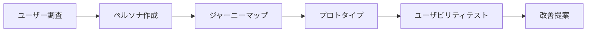

# 📱 [緊急度：中] mobile-banking-ux コンテンツ作成

## 問題の詳細

### 現象
- Storageに `mobile-banking-ux` トレーニングが存在しない
- Edge Function のログで「トレーニング test のindex.mdが読み込めませんでした」というエラーが発生
- 完全なトレーニングコンテンツセットが不足している

### 現在のトレーニング状況
```
存在するトレーニング:
✅ ec-product-catalog
✅ info-odai-book-rental  
✅ todo-app
✅ ux-basics

不足しているトレーニング:
❌ mobile-banking-ux
```

### 影響範囲
- トレーニングコンテンツの品揃え
- UXトレーニングの幅
- ユーザーの学習選択肢

## 調査手順

### 1. 既存設計ドキュメントの確認
```
docs-dev-training/my-tasks/test-training-content/mobile-banking-ux/
├── overview.md
├── task-persona-journey.md
├── task-prototype-testing.md
└── task-user-research.md
```

### 2. 他のトレーニング構造の分析
```
参考構造 (ec-product-catalog):
content/training/ec-product-catalog/
├── index.md
└── tasks/
    ├── information-architecture/content.md
    ├── requirements-analysis/content.md
    └── ui-wireframe/content.md
```

### 3. コンテンツ要件の整理
- UXデザインの実践的スキル習得
- モバイルバンキングという具体的なドメイン
- ペルソナ〜プロトタイプまでの一貫した流れ

## 解決策の実装内容

### A. mobile-banking-ux ディレクトリ構造作成
```
content/training/mobile-banking-ux/
├── index.md
└── tasks/
    ├── user-research/
    │   └── content.md
    ├── persona-journey/
    │   └── content.md
    └── prototype-testing/
        └── content.md
```

### B. index.md の作成
```yaml
---
title: "モバイルバンキングUX設計"
description: "ユーザー調査からプロトタイプテストまでの実践的UXデザイン"
type: "challenge"
difficulty: "上級"
tags: ["UX", "モバイル", "金融", "ユーザー調査", "プロトタイプ"]
thumbnail: "/assets/backgrounds/mobile-banking-bg.svg"
category: "UXデザイン"
estimated_total_time: "8-12時間"
task_count: 3
is_premium: true
icon: "🏦"
skills:
  - title: "ユーザー調査"
    description: "定性・定量調査の設計と実施"
  - title: "ペルソナ設計"  
    description: "調査結果に基づく具体的なペルソナ作成"
  - title: "ユーザージャーニー"
    description: "タッチポイントとペインポイントの可視化"
  - title: "プロトタイプ作成"
    description: "Figmaでのインタラクティブプロトタイプ"
  - title: "ユーザビリティテスト"
    description: "プロトタイプを用いた検証手法"
guide:
  title: "モバイルバンキングアプリの体験設計"
  description: "既存のバンキングアプリの問題点を特定し、より良いユーザー体験を設計します"
  lesson:
    title: "UXリサーチの基礎"
    emoji: "🔍"
    description: "ユーザー調査の基本的な手法を学ぶ"
    link: "/series/ux-research-basics"
  steps:
    - title: "ユーザー調査の設計・実施"
      description: "現在のバンキングアプリの利用実態を調査"
    - title: "ペルソナ・ジャーニーマップ作成"  
      description: "調査結果を元にユーザー像と行動フローを設計"
    - title: "プロトタイプ作成・テスト"
      description: "改善案をプロトタイプ化し、ユーザビリティテストで検証"
---

# モバイルバンキングUX設計チャレンジ

このチャレンジでは、実際のモバイルバンキングアプリを題材に、UXデザインの全工程を体験します。

## 学習目標

- 実践的なユーザー調査手法の習得
- データに基づくペルソナ設計
- ユーザージャーニーマップの作成
- プロトタイプ駆動の設計手法
- ユーザビリティテストの実施

## 前提知識

- Figmaの基本操作
- UXデザインの基礎概念
- 調査・分析に対する興味
```

### C. 各タスクコンテンツの作成

#### user-research/content.md
```yaml
---
title: "ユーザー調査の設計・実施"
description: "モバイルバンキングアプリの利用実態を調査する"
slug: "user-research"
order_index: 1
is_premium: true
difficulty: "上級"
estimated_time: "3-4時間"
video_preview: "https://example.com/mobile-banking-research-preview.mp4"
video_full: "https://example.com/mobile-banking-research-full.mp4"
preview_sec: 30
next_task: "persona-journey"
training_title: "モバイルバンキングUX設計"
---

# ユーザー調査の設計・実施

## 課題概要
現在のモバイルバンキングアプリのユーザー体験を理解するため、適切な調査を設計・実施します。

## 調査目標
- ユーザーの銀行アプリ利用頻度・用途の把握
- 現在の体験における課題点の特定
- 改善のヒントとなるインサイトの発見

## 実施手順

### 1. 調査設計
- 調査手法の選定（アンケート/インタビュー/行動観察）
- 調査対象者の定義
- 調査項目の設計

### 2. 調査実施
- 実際の調査実行
- データ収集

### 3. 結果分析
- 定量データの集計
- 定性データの分析
- インサイトの抽出

## 成果物
- 調査設計書
- 調査結果レポート
- インサイト一覧
```

#### persona-journey/content.md
```yaml
---
title: "ペルソナ・ジャーニーマップ作成"
description: "調査結果を元にユーザー像と行動フローを設計する"
slug: "persona-journey"
order_index: 2
is_premium: true
difficulty: "上級"
estimated_time: "3-4時間"
video_preview: "https://example.com/mobile-banking-persona-preview.mp4"
video_full: "https://example.com/mobile-banking-persona-full.mp4"
preview_sec: 30
prev_task: "user-research"
next_task: "prototype-testing"
training_title: "モバイルバンキングUX設計"
---

# ペルソナ・ジャーニーマップ作成

## 課題概要
前段の調査結果を基に、具体的なペルソナとその行動フローを可視化します。

## 作成内容

### 1. ペルソナ設計
- プライマリーペルソナの設定
- セカンダリーペルソナの設定
- ペルソナの詳細情報（属性・動機・課題）

### 2. ジャーニーマップ作成
- 現在の行動フロー（As-Is）
- 理想の行動フロー（To-Be）
- タッチポイントの整理
- ペインポイントの特定

## 成果物
- ペルソナシート
- カスタマージャーニーマップ
- 改善機会の整理
```

#### prototype-testing/content.md
```yaml
---
title: "プロトタイプ作成・テスト"
description: "改善案をプロトタイプ化し、ユーザビリティテストで検証する"
slug: "prototype-testing"
order_index: 3
is_premium: true
difficulty: "上級"
estimated_time: "4-5時間"
video_preview: "https://example.com/mobile-banking-prototype-preview.mp4"
video_full: "https://example.com/mobile-banking-prototype-full.mp4"
preview_sec: 30
prev_task: "persona-journey"
training_title: "モバイルバンキングUX設計"
---

# プロトタイプ作成・テスト

## 課題概要
ペルソナとジャーニーマップを基に、改善されたモバイルバンキングアプリのプロトタイプを作成し、検証します。

## 実施内容

### 1. プロトタイプ作成
- Figmaでのワイヤーフレーム作成
- インタラクティブプロトタイプの実装
- 主要フローの実装

### 2. ユーザビリティテスト設計
- テストシナリオの作成
- 評価指標の設定
- テスト環境の準備

### 3. テスト実施・分析
- 実際のユーザーテスト実行
- 結果の分析
- 改善提案の作成

## 成果物
- インタラクティブプロトタイプ
- ユーザビリティテスト結果
- 最終改善提案書
```

### D. 背景画像・アセットの準備
```
public/assets/backgrounds/mobile-banking-bg.svg
- モバイルとバンキングを象徴するSVG
- 既存のデザインシステムに合致する配色
```

## テスト方法

### 1. ファイル構造確認
```bash
# ディレクトリ作成確認
ls -la content/training/mobile-banking-ux/
ls -la content/training/mobile-banking-ux/tasks/
```

### 2. フロントマター検証
```javascript
// YAML構文チェック
import yaml from 'js-yaml';
const content = fs.readFileSync('content/training/mobile-banking-ux/index.md', 'utf8');
const match = content.match(/^---\s*\n([\s\S]*?)\n---/);
const parsed = yaml.load(match[1]);
console.log(parsed);
```

### 3. Storage同期確認
```bash
# アップロードスクリプト実行
node scripts/sync-training-content.js
```

### 4. Edge Function確認
```bash
# トレーニング一覧にmobile-banking-uxが含まれることを確認
curl -X POST "https://fryogvfhymnpiqwssmuu.supabase.co/functions/v1/get-training-list"
```

### 5. UI表示確認
- `/training` ページで5つのトレーニングが表示されることを確認
- `mobile-banking-ux` カードが正しく表示されることを確認

## 完了基準

- [ ] `content/training/mobile-banking-ux/` ディレクトリ構造が作成されている
- [ ] `index.md` が適切なフロントマターとコンテンツを含んでいる
- [ ] 3つのタスクファイルが作成されている
- [ ] Storage に正常にアップロードされている
- [ ] Edge Function で5つのトレーニングが返される
- [ ] UI で「モバイルバンキングUX設計」カードが表示される
- [ ] プレミアムコンテンツとして適切に制御されている

## 関連ファイル

### 新規作成対象
- `content/training/mobile-banking-ux/index.md`
- `content/training/mobile-banking-ux/tasks/user-research/content.md`
- `content/training/mobile-banking-ux/tasks/persona-journey/content.md`
- `content/training/mobile-banking-ux/tasks/prototype-testing/content.md`

### アセット作成
- `public/assets/backgrounds/mobile-banking-bg.svg`

### 確認対象
- `scripts/sync-training-content.js`
- `supabase/functions/get-training-list/index.ts`

### 参考ファイル
- `docs-dev-training/my-tasks/test-training-content/mobile-banking-ux/`

## 技術的詳細

### コンテンツ設計方針
- **実践性重視**: 実際のアプリを題材にした具体的な課題
- **段階的学習**: ユーザー調査 → 分析 → プロトタイプ → 検証の流れ
- **成果物重視**: 各段階で明確な成果物を定義

### UXデザインプロセス


### 難易度設定の根拠
- **上級レベル**: 複数のUXスキルを統合的に使用
- **高時間設定**: 調査・分析・制作の時間を考慮
- **プレミアム設定**: 高価値コンテンツとしての位置づけ

### 既存トレーニングとの差別化
- **ec-product-catalog**: 情報設計中心
- **mobile-banking-ux**: UXプロセス全体（NEW）
- **info-odai-book-rental**: 情報設計基礎
- **todo-app**: UIデザイン実践
- **ux-basics**: UX概念学習

## 優先度・緊急度
**緊急度：中** - コンテンツ充実化のための重要な追加要素